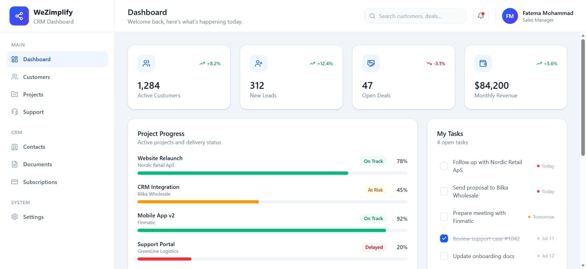
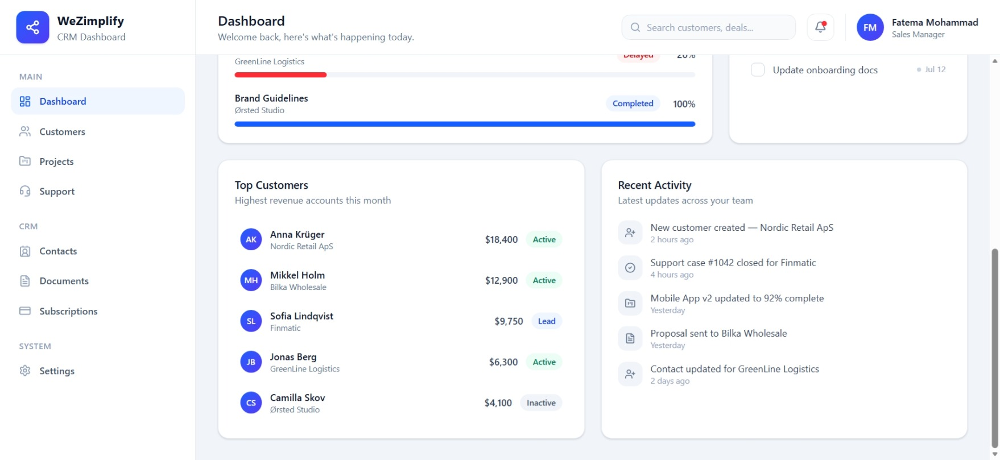
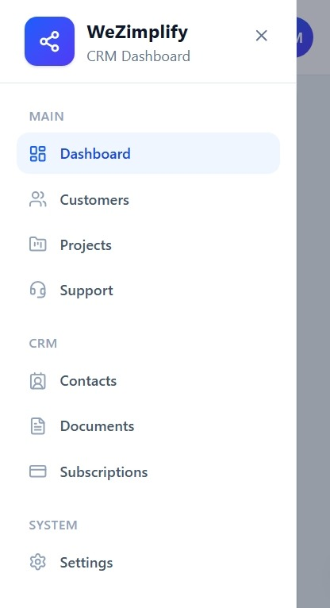
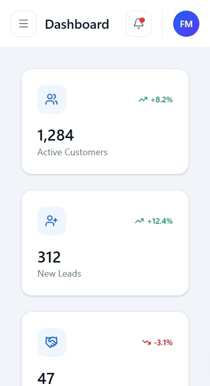
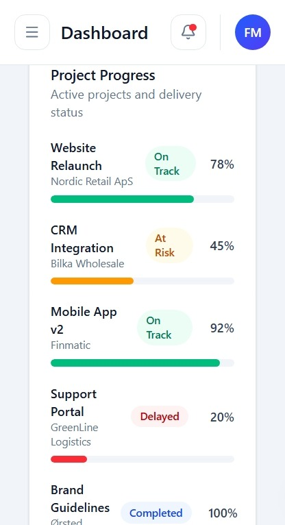

# WeZimplify CRM Dashboard

A CRM dashboard UI built with React, TypeScript, and Tailwind CSS. It provides a quick overview of KPIs, project progress, tasks, top customers, and recent team activity through a responsive dashboard layout.

## Dashboard Preview 

### Overview




### Project Progress & Tasks




## Responsive Design

### Mobil Hamburger Menu

### Mobil Details



## Tech Stack

- React 19 + TypeScript
- Vite
- Tailwind CSS 4
- lucide-react (icons)

## Getting Started

```bash
npm install
npm run dev
```

Other scripts:

```bash
npm run build     # type-check and build for production
npm run lint       # run ESLint
npm run preview    # preview the production build locally
```

## Project Structure

```
src/
  components/
    common/     # Card, Badge, Avatar, ProgressBar - shared building blocks
    layout/     # Sidebar, SidebarSection, SidebarItem, SidebarLogo, Header
    dashboard/  # StatCard, ProjectProgress, TaskList, CustomerOverview, ActivityFeed
  data/         # Mock data for stats, projects, tasks, customers, activity, navigation
  pages/        # Dashboard page composing the dashboard sections
  App.tsx       # App shell: responsive sidebar, header, and scrollable content area
```

## Documentation

- [docs/DESIGN_DECISIONS.md](docs/DESIGN_DECISIONS.md) - why the app is structured and styled the way it is
- [docs/UI_GUIDELINES.md](docs/UI_GUIDELINES.md) - design tokens (spacing, radius, color, typography)
- [docs/DEVELOPMENT.md](docs/DEVELOPMENT.md) - development log by feature
- [docs/TODO.md](docs/TODO.md) - project progress checklist
